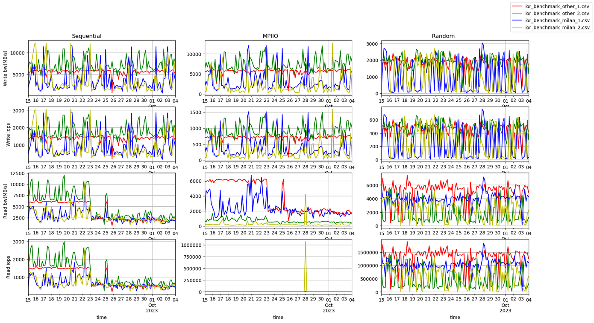

# gpfs-perf-check
The idea behind GPFS performance check is to run a series of high-loaded I/O operations on regular basis and chart the results. 
The software used to perform the required I/O operations is IOR. Test jobs are submitted using cron every 4 hours.The main script, which is executed on cron is [submit_all](./submit_all)

The script submits 6 jobs, each checking different I/O patterns. Currently, the test is divided into two parts: Mahuika and MEX testing, each part uses 3 patterns: single node test, MPI I/O test with 2 nodes and MPI I/O test with 16 nodes. 

Each job submits a script called [benchmark.sl](./benchmark.sl)

The script executes 6 IOR runs, which perform testing on the following operations: write operation with 4 Mb chunks, read operation with 4 Mb chunks,  MPI I/O write operations with 8 Mb chunks, MPI I/O read with 8Mb chunks and two random read/write operations with 16 Mb chunks. Times of all of these tests are then collected into the CSV file. 

Therefore submitall script will end up generating or updating 6 files (one for each type of testing). 

CSV files, which are generated at the end of the testing, have a very simple structure. The first column is the time of the test, followed by 6 pairs of time columns (one pair per IOR test, see above). Each pair gives time for the operation it represents and the latency of the operation. Both values are in seconds.
[
To build the chart there is a python code [analyse.py](./analyse.py). 

An example, 
```bash
python analyse.py -i ior_benchmark_other_1.csv,ior_benchmark_other_2.csv,ior_benchmark_milan_1.csv,ior_benchmark_milan_2.csv -o result.png -f "2023-09-15 00:00" -r 4H
```



<small>It is visible that the read file operations timing and latency dropped on the 23rd and have not recovered yet. The read latency graph has a significant outlier on the 28th, which can be removed with the outlier setting in the command line.</small>