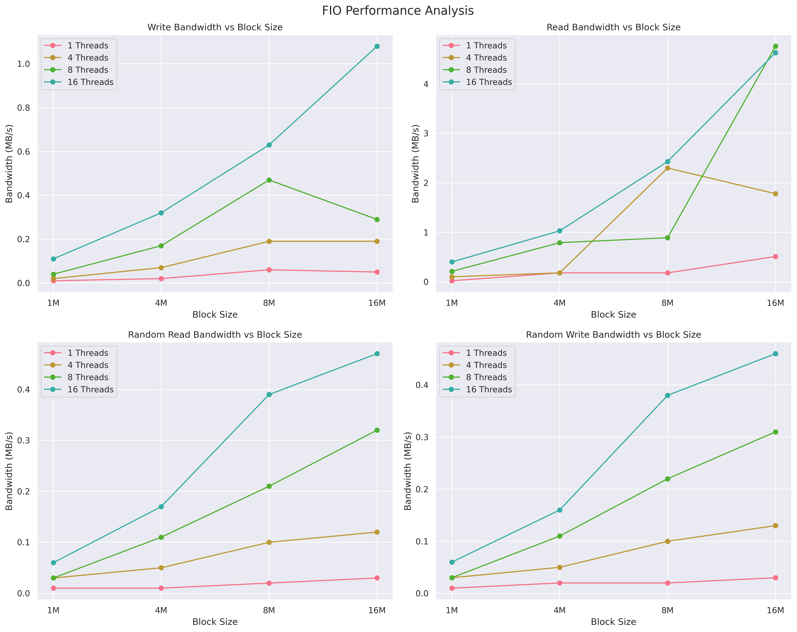

# This test suite provides a comprehensive evaluation of GPFS client performance. Here's what it tests:

1. Sequential Read/Write Performance
    - Tests with different block sizes (1M to 16M)
    - Tests with varying numbers of threads (1 to 16)
    - Measures throughput and latency

2. Random Read/Write Performance
    - Mixed workload testing
    - Various thread counts and block sizes
    - IOPS measurement

3. Metadata Performance
    - File creation speed
    - Small file handling

## To use this test:

1. Make sure FIO is installed
2. Modify the `TEST_DIR` variable to point to your GPFS test directory. This will be used to write .dat files
3. Adjust `FILE_SIZE` and other parameters as needed

## `analyse.py`

* Sample output

```bash
Verification of parsed randrw data:
   block_size  threads  Read Bandwidth  Write Bandwidth  Read IOPS  Write IOPS
32         1M        1            0.01             0.01   6.613360    6.946527
33         1M        4            0.03             0.03  25.773624   27.153760
34         1M        8            0.03             0.03  28.993217   30.489427
35         1M       16            0.06             0.06  63.732785   63.764445
36         4M        1            0.01             0.02   3.542502    3.858500
37         4M        4            0.05             0.05  12.435250   13.066144
38         4M        8            0.11             0.11  27.373544   28.714925
39         4M       16            0.17             0.16  42.581281   41.817777
40         8M        1            0.02             0.02   2.863374    3.013201
41         8M        4            0.10             0.10  12.578302   13.111422
42         8M        8            0.21             0.22  26.772218   27.925387
43         8M       16            0.39             0.38  49.414887   48.871339
44        16M        1            0.03             0.03   2.201294    2.052335
45        16M        4            0.12             0.13   7.832247    8.148197
46        16M        8            0.32             0.31  20.289478   20.062054
47        16M       16            0.47             0.46  29.878419   29.287742

Summary Statistics:

Write Performance:
           mean   max
threads              
1        0.0350  0.06
4        0.1175  0.19
8        0.2425  0.47
16       0.5350  1.08

Read Performance:
           mean   max
threads              
1        0.2225  0.51
4        1.0900  2.30
8        1.6625  4.76
16       2.1225  4.63

Random R/W Performance:
        Read Bandwidth       Write Bandwidth        Read IOPS            Write IOPS           
                  mean   max            mean   max       mean        max       mean        max
threads                                                                                       
1               0.0175  0.03          0.0200  0.03   3.805133   6.613360   3.967641   6.946527
4               0.0750  0.12          0.0775  0.13  14.654856  25.773624  15.369881  27.153760
8               0.1675  0.32          0.1675  0.31  25.857114  28.993217  26.797948  30.489427
16              0.2725  0.47          0.2650  0.46  46.401843  63.732785  45.935326  63.764445
```
